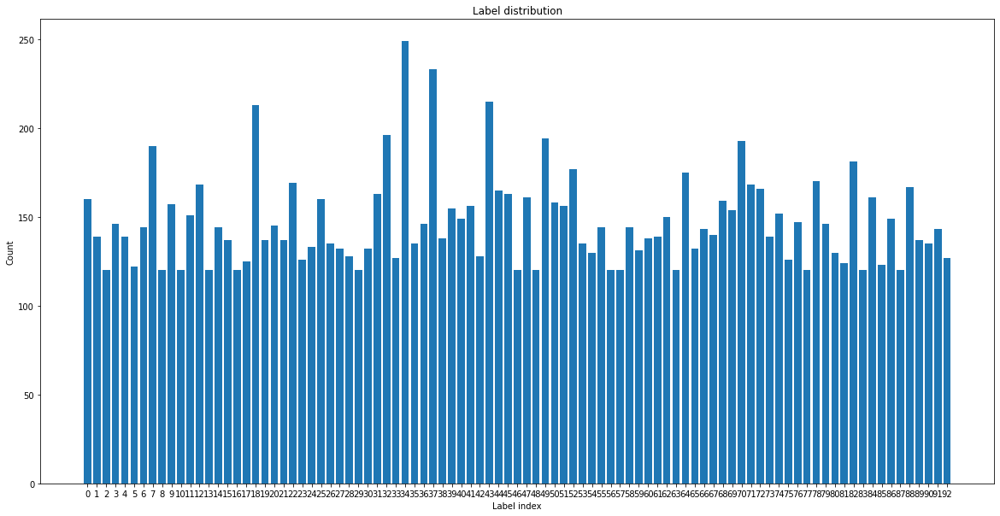
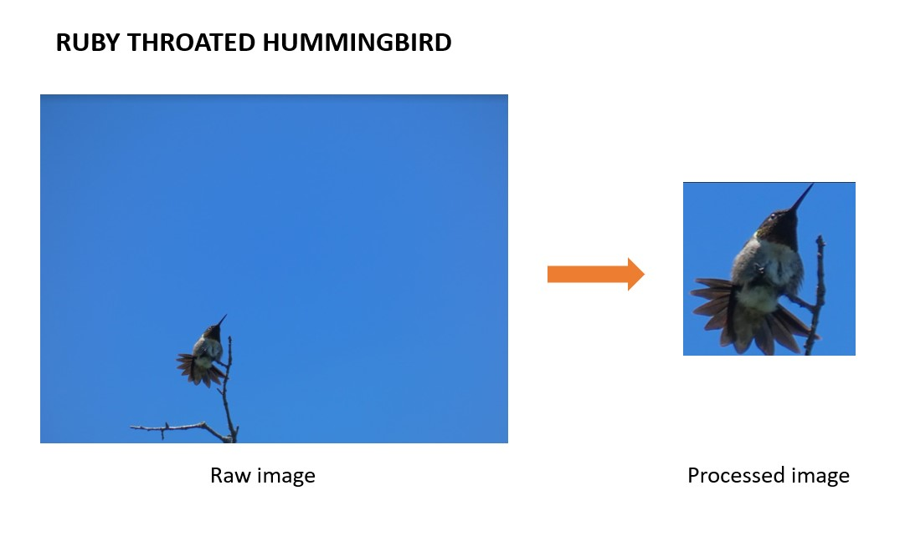

# bird-classifcation
This project was developed as a part of the [Erdos Institute Data Science Bootcamp 2022](https://www.erdosinstitute.org/code).

### Team Members:
- [Soumen Deb](https://www.linkedin.com/in/soumen-deb-193005b0/)
- [Adam Kawash](https://www.linkedin.com/in/adam-kawash-90077b215/)
- [Allison Londeree](https://www.linkedin.com/in/allison-londeree/)
- [Moeka Ono](https://www.linkedin.com/in/moeka-ono/)

## Summary

## Dataset
The dataset used for this project can be found on [Kaggle](https://www.kaggle.com/datasets/gpiosenka/100-bird-species). The original dataset "Birds 400" includes 400 bird species with 58388 training images, 2000 test images, and 2000 validation images. All images are 224 X 224 X 3 color images in jpg format. Each image contains only one bird and the bird typically takes up at least 50% of the pixels in the image. 

In our project, we focused on the North American bird. We scraped a list of 3515 bird species from [Wekipedia] (https://en.wikipedia.org/wiki/List_of_birds_of_the_United_States) (as of 6/1/2022). By cross-referencing the information from Wikipedia and Kaggle, We created a dataset of images of 93 North American birds from the original dataset to explore optimal algorithms to classify the selected species. The training dataset of the 93 species had 120-249 images (avg: 147 images) per species. Both validation and test data included 5 images per species. 

In addition, we created an independent dataset of 22 bird species with 1-3 images per species, photographed by an amateur photographer, Isaac Ahuvia, in the east coast. The images were minimally preprocessed. All images were cropped in relation to the center of the image and resampled to our desired size of 224 x 224 pixels. Images were cropped manually such that the bird consumed approximately 50% or more of the image, and resampled to our desired size. An example of the preprocession is as below:

## Methodology

## Results
